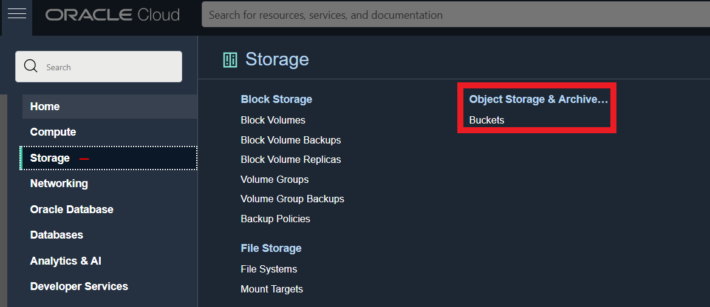
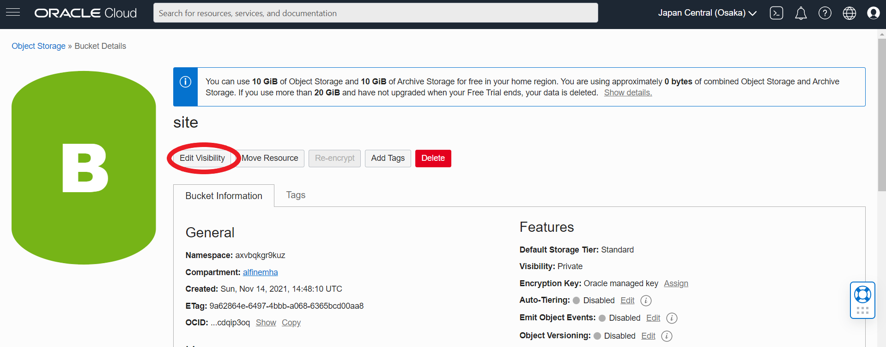
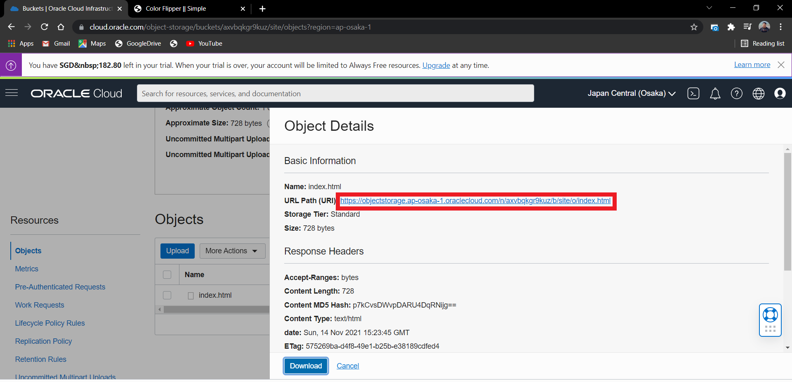

# 08 - Object Storage

1. Membuat bucket untuk website. Sign-in ke OCI kemudian pilih Object Storage

    a. Create Bucket → Pilih standar bucket.

    b. (Bucket Name → bebas)

    c. Buka bucket dengan melakukan klik pada nama bucket kemudian pilih Edit Visibility. Pilih Visibility 
menjadi Public. Tekan Save Changes untuk menyimpan perubahan.

2. Uploading web page. Pada bagian bawah dari Bucket Information terdapat box Object (upload 
semua file yang ada pada folder colorFliper)

    a. Setelah upload index.html file → Klik titik 3 pada sisi kiri file index.html

    b. Kemudian pilih View Object Detail (Panel detail akan menunjukkan detail URL objek)

    c. Kemudian pilih URL Path (URI) untuk membuka file

    d. Jika file yang di upload berhasil tampilan pada halaman akan seperti pada gambar di bawah ini:

# Tugas 

1. Buatlah laporan dan dokumentasi dari praktikum yang Anda lakukan.
2. Carilah aplikasi web static kemudian upload ke Object Storage yang telah Anda buat.

