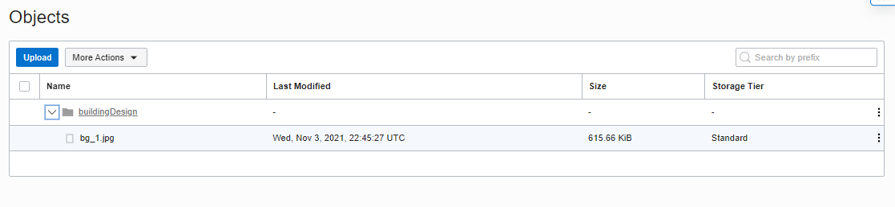

# 09 - UTS

## Tugas

Memanfaatkan Object Storage sebagai media penyimpanan assets dan mengubungkanNYA

## langkah-langkah

1. Membuat Compartements baru.

2. Membuat Bucket

3. Membuat Group baru

4. Membuat Police

Police disini berfungsi untuk menambahkan aturan baru supaya group yang telah kita buat tadi bisa mengelola bucket

5. Download composer AWS untuk menghubungkan project laravel dengan oracel cloud

6. Menghubungkan project laravel dengan oracle cloud

7. Melakukan testing bucket

Melakukan testing apakah asset bisa masuk ke dalam bucket atau tidak

Dari bukti tersebut dapat dilihat bahwa asset pada website sudah bisa tersimpan dalam bucket object storage, namun website belum bisa mengambil asset tersebut dari bucket jadi gambar pada website tidak muncul

8. Melakukan reed data atau pengambilan asset dari bucket

Dalam masalah ini kita cukup mengambil asset dengan menghapus storage lokal supaya asset dapat langsung memanggil pada object storage

Gambar sudah muncul pada website

9. clone source code project dari github pada vm kita

10. Membuat database baru building_design

11. Mengganti connection database pada file .env

12. Install dan update composer

13. Migrate data dari database yang baru kita buat

14. Install fpm php

15. Mengubah root default pada VM supaya bisa menampilan project yang baru kita buat

16. Melakukan generate key

17. Tampilan website

Gambar atau asset tersebut adalah gambar yang telah kita inputkan tadi dan sekarang sudah berhasil untuk ditampilkan.

Dari gambar tersebut sudah terbukti bahwa gambar tersebut diambil dari object storage