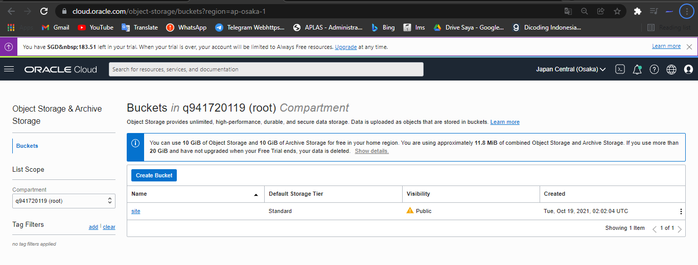
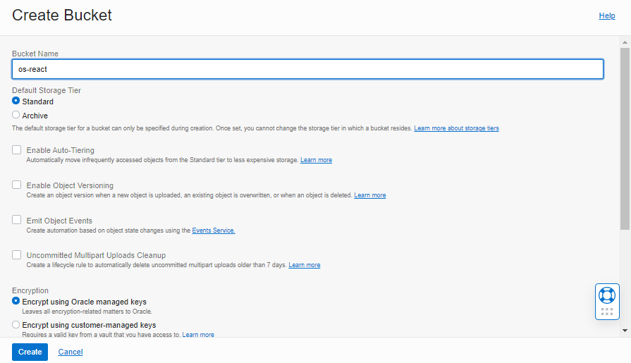
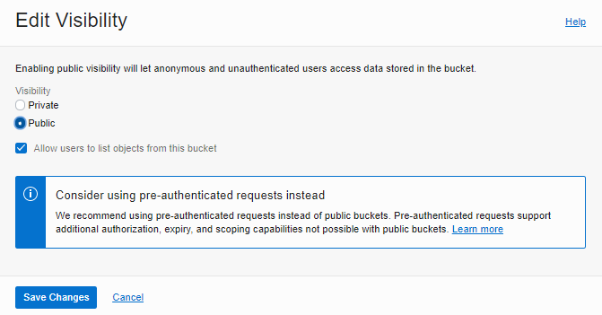
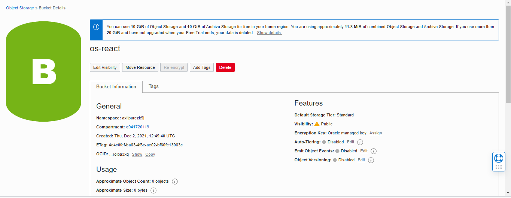
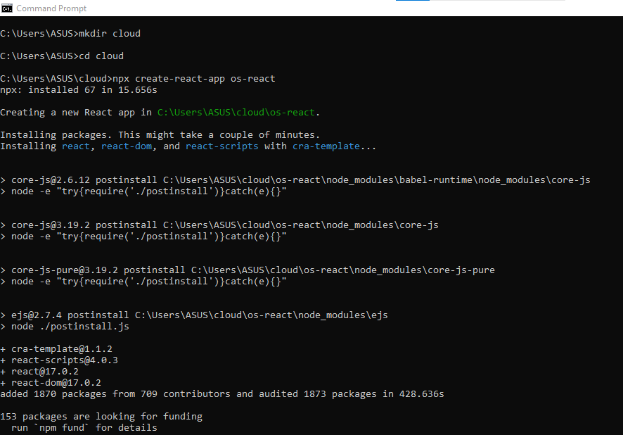
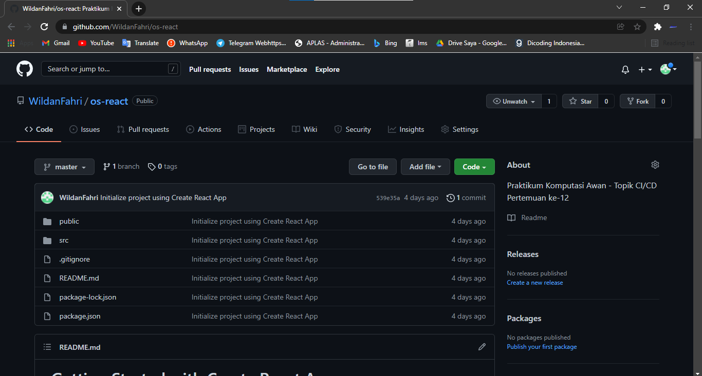
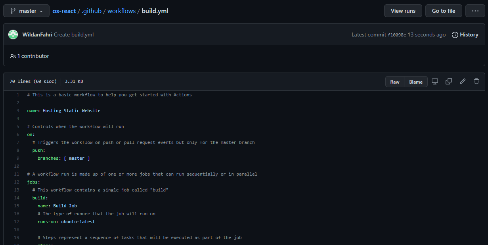

# 11 - Docker 2

### 1. Docker Network

Pada praktikum yang pertama akan melakukan pembuatan network pada docker agar container yang dibuat bisa terhubung ke server lain atau berkomunikasi dengan dunia luar, dan juga container yang lain.

#### 1.1 Membuat dan Memeriksa Docker Network

1. Pertama ketik perintah di bawah ini untuk mengetahui network yang tersedia pada docker host kita.

2. Pertama ketik perintah di bawah ini untuk mengetahui network yang tersedia pada docker host kita

3. Untuk membuat network bisa menggunakan perintah create seperti pada gambar di bawah ini

4. Selanjutnya cek network yang sudah dibuat menggunkan perintah ls, seharusnya akan menambahkan network. Hasilnya adalah sebagai berikut

5. Terakhir, ketika ingin mengetahui informasi detail dari network yang telah kita buat bisa menggunakan perintah inspect

Dari praktikum pertama kita telah membuat network yaitu myNetwork, network tersebut selanjutnya bisa digunakan untuk menghubungkan container satu dengan yang lain.

#### 1.2 Menghubungkan Container ke Network

1. Buat terlebih dahulu contoh container, misalkan kita akan membuat container linux yaitu busybox.
   

2. Buat container yang kedua menggunakan image linux alphine, buka windows yang baru agar container1 tetap berjalan
   

3. Kemudian cek masing-masing container tersebut menggunakan perintah ps untuk mengetahui status container yang sedang jalan. Buka windows baru jalankan perintah berikut
   

4. Kemudian jalankan inspect untuk mengetahui informasi detail dari masing-masing container.
   

5. Untuk membuktikan silakan ping dari container1 ke container2, seharusnya akan reply.
   

Setelah melakukan konfigurasi network selanjutnya bisa dimanfaatkan untuk diimplementasikan pada image aplikasi yang kita buat sendiri.

