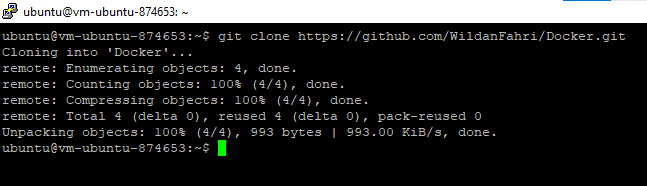
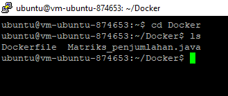
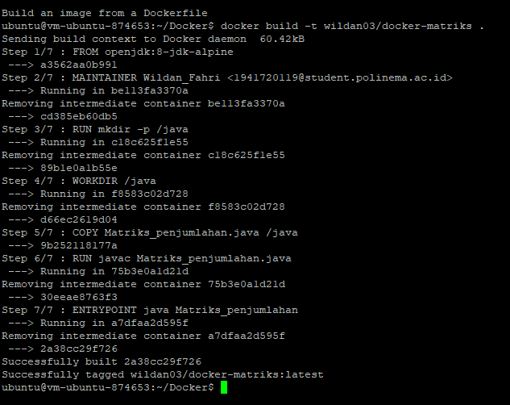
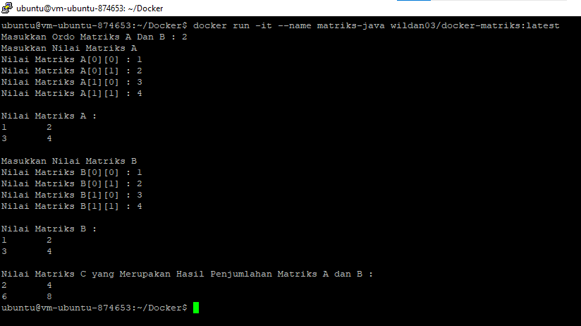

# 13 - Kuis 2

## Soal

Buatlah docker image dan di push ke docker hub.

## Hasil

### 1. Build Image

1. Clone project dari repository terlebuh dahulu
   

2. Kemudian masuk ke dalam direktori file yang baru kita clone
   

3. Langkah selanjutnya melakukan build seperti berikut
   

4. Terakhir kita test dengan melakukan run
   
   Dalam Project ini saya menggunakan file java untuk menghitung penjumlahan matriks

