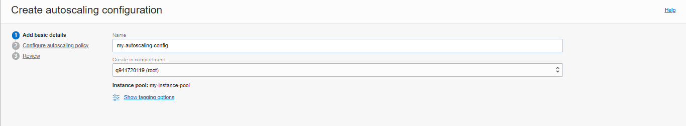

# 15 - Autoscalling oracle cloud

### 1. Membuat Konfigurasi Instance

1. Pada halaman detail instance, klik menu More Actions dan pilih Create Instance Configuration.
   

2. Pilih kompartemen Anda.

3. Untuk nama, masukkan instance-config.
   

4. Click Create Instance Configuration.
   

### 2. Membuat instance pool

1. klik Create Instance pool

2. Dari daftar Kompartemen, pilih kompartemen tempat Anda membuat konfigurasi instans.

3. Untuk nama, masukkan my-instance-pool.

4. Dari daftar Konfigurasi Instance, pilih instance-config.

5. Untuk number of instans, masukkan 3. Jumlah instans menunjukkan jumlah maksimum instans yang dapat disediakan di kolam instans. Jumlah instans yang dapat disediakan bergantung pada batas layanan penyewa Anda dan ketersediaan bentuk komputasi di wilayah Anda.
   

6. Klik next
   Pada halaman Configure Pool Placement, Anda dapat menambahkan satu atau beberapa availability domain. Untuk setiap domain, Anda dapat menentukan fault domain, primary virtual cloud network (VCN), dan subnet. Secara default, instans dalam kolam didistribusikan di semua fault domain. Jika kapasitas tidak tersedia di satu fault domain, instans ditempatkan di fault domain lain untuk memungkinkan kumpulan instans berhasil diluncurkan. Anda dapat meminta agar instans didistribusikan secara merata di setiap fault domain yang Anda pilih untuk skenario ketersediaan tinggi.
   Selain itu, Anda dapat mengaitkan loadbalancer dengan kumpulan instans dengan memilih kotak centang Lampirkan loadbalancer. Untuk menggunakan fitur ini, Anda harus memiliki loadbalancer dulu.
   Untuk melanjutkan, pilih AD1 untuk availability domain, VCN dan subnet. Klik Next dan kemudian Create untuk membuat kolam instans.

7. Untuk fault domain pilih FAULT-DOMAIN-1, FAULT-DOMAIN-2, FAULT-DOMAIN-3
   

8. Karena ada keterbatasan layanan penyewa nampaknya instance bisa dibuat hanya 1 buah.
   
   Disini saya terjadi error karena saya memiliki lebih dari 1 instance, solusinya kita bisa menghapus instance yang tidak digunakan
   
   

### 3. Membuat konfigurasi Autoscalling

1. Klik menu More Actions dan pilih Create Autoscaling Configuration.

2. Untuk nama, masukkan my-autoscaling-config.

3. Dari daftar Buat di kompartemen, pilih kompartemen tempat Anda membuat kumpulan instans.
   

4. Klik Next.

5. Pada halaman Configure Autoscaling Policy, Anda dapat memilih Metric-based Autoscaling atau Schedule-based Autoscaling.
   

6. Setelah Anda mengonfigurasi Autoscalling policy, klik Create. Anda dapat menentukan beberapa konfigurasi penskalaan otomatis untuk kumpulan instance yang sama, dan Anda dapat mengaktifkan atau menonaktifkannya salah satunya.
   

## Tugas

1. Lakukan langkah-langkah di atas, dan buat laporan.
2. Jelaskan Apa kaitan Autoscalling dengan Availability?

Auto scaling meningkatkan availability dan waktu aktif, terutama saat beban kerja produksi kurang dapat diprediksi.

Sementara banyak bisnis memiliki siklus harian, mingguan, atau tahunan yang ditetapkan untuk mengatur penggunaan server, auto scaling berbeda karena mengurangi kemungkinan memiliki terlalu banyak atau terlalu sedikit server untuk beban lalu lintas yang sebenarnya. Ini karena auto scaling responsif terhadap pola penggunaan aktual, berbeda dengan solusi scaling statis.

Misalnya, scaling solusi statis mungkin bergantung pada gagasan bahwa lalu lintas biasanya lebih rendah pada pukul 2:00 pagi, dan mengirim beberapa server untuk tidur pada waktu itu. Namun, dalam praktiknya mungkin ada lonjakan pada saat itu—mungkin saat acara berita viral atau waktu tak terduga lainnya.
